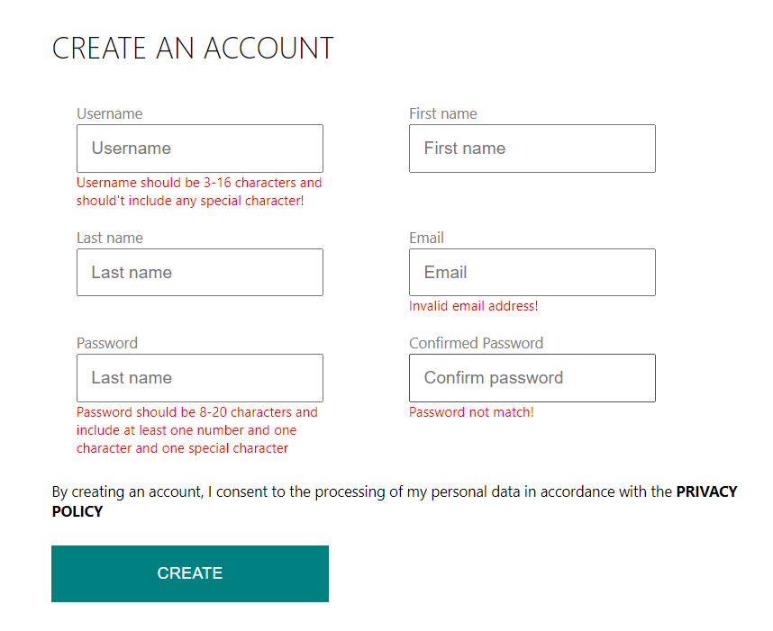

# flash-sale-system

Definition:

xxxxxxxxxx apiVersion: v1kind: PersistentVolume            # Create a PersistentVolumemetadata:  name: mysql-pv  labels:    type: localspec:  storageClassName: standard      # Storage class. A PV Claim requesting the same storageClass can be bound to this volume.   capacity:   storage: 250Mi  accessModes:    - ReadWriteOnce  hostPath:                       # hostPath PersistentVolume is used for development and testing. It uses a file/directory on the Node to emulate network-attached storage    path: "/mnt/data"  persistentVolumeReclaimPolicy: Retain  # Retain the PersistentVolume even after PersistentVolumeClaim is deleted. The volume is considered “released”. But it is not yet available for another claim because the previous claimant’s data remains on the volume. type: post​---    ​apiVersion: v1kind: PersistentVolumeClaim        # Create a PersistentVolumeClaim to request a PersistentVolume storagemetadata:                          # Claim name and labels  name: mysql-pv-claim  labels:    app: polling-appspec:                              # Access mode and resource limits  storageClassName: standard       # Request a certain storage class  accessModes:    - ReadWriteOnce                # ReadWriteOnce means the volume can be mounted as read-write by a single Node  resources:    requests:      storage: 250Mitype: postyaml

## Scenario

The scenario involves a retailer providing customers with limited chances to purchase limited edition sneakers.

It comes with the following **characteristics**:

- Large number of users come to the system at the same time, causing a spike in traffic.
- Number of ordering request is much larger than inventory size.

## Challenges

- **Avoid inventory from being oversold or undersold.**
- **Provide high throughput to handle high traffic and high concurrency.** There will be many concurrent read and write to the limited inventory records. It can be considered challenging since Databases have limited QPS. 
- **Other service works normally**. Ensure that the system will not be hung up under high concurrent requests and cannot affect other services.

## System Design

## Frontend Features

Register a new account and the data validation

