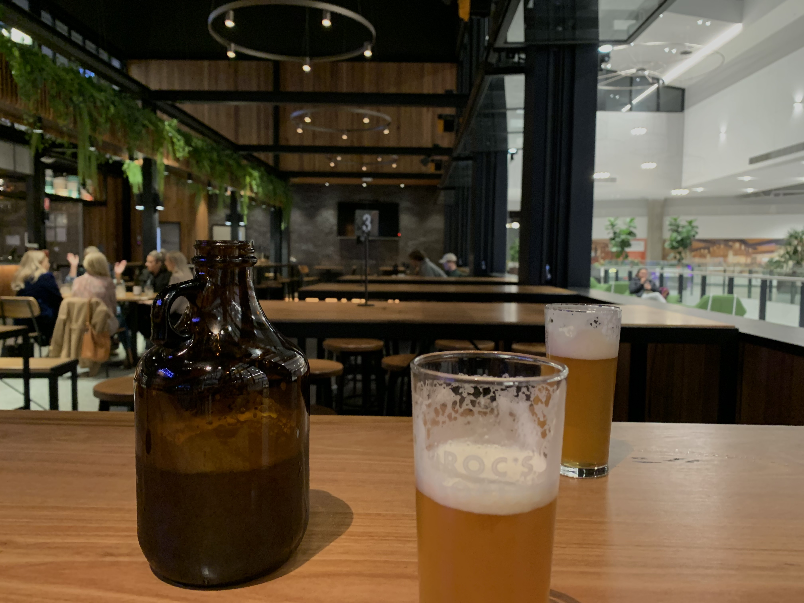

# Cheers!

True! it is working now! 

I can now write the md file down via Typora and then react-markdown helps me to convert it and render to the component HAHAHA! 


THAT IS SO COOL!





------

*Edit on 22-07-01:* 

It is really a pain to dynamically import images using require() function in React 

e.g.  ``````

since require() accepts relative path only if it is rendered before executed. I finally found the solution is to import all the images in advance so that they all are stored statically(in /public folder), which is use ```importAll(require.context('./markdown/images', false, /\.(png|jpe?g|svg)$/));```

Thanks to: 

[https://stackoverflow.com/questions/42118296/dynamically-import-images-from-a-directory-using-webpack](https://stackoverflow.com/questions/42118296/dynamically-import-images-from-a-directory-using-webpack)

 

------

*Edit on 22-08-06:* 

now I use react-syntax-highlighter to improve UI of code snippets and make changes on some css making it more tidy. So yeah... cheers🍺


