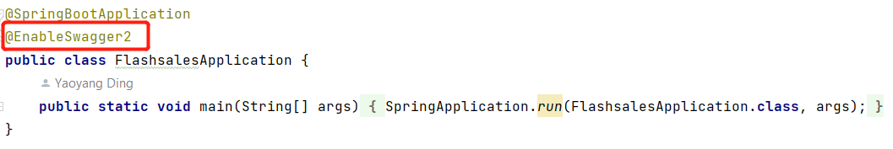
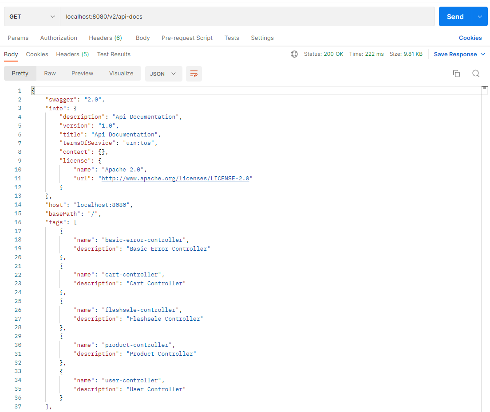
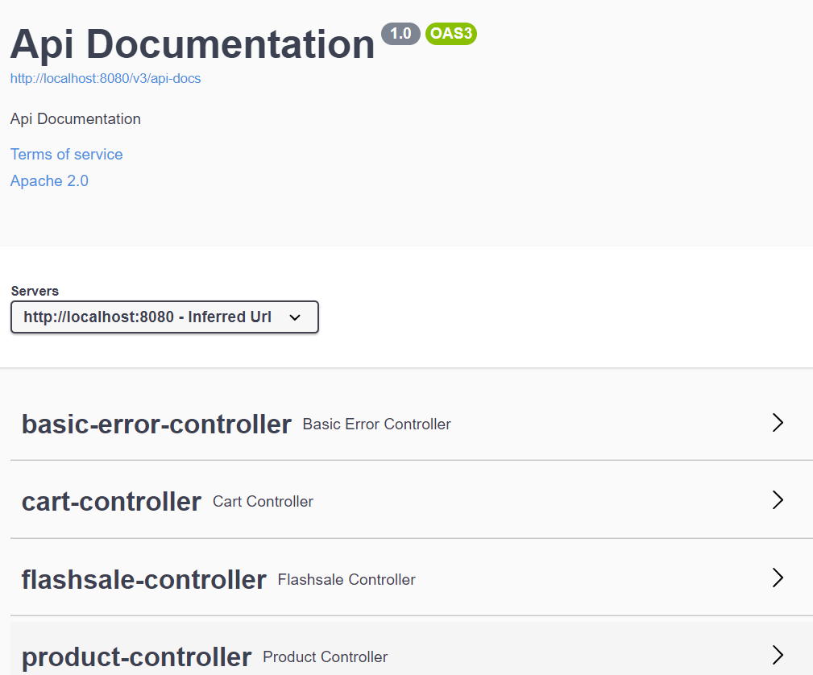

During the development of our API endpoints, it is essential that there is a API documentation for testing and documentation. Moreover, for the front-end side, it would be much easier to do testing all in together without adding multiple http requests in Postman. 

So Swagger is the thing that I have found recently that is super easy and powerful API documentation generator (since previously we had to manually create server landing page as our API documentation during the flask rest API development due to insufficient knowledge of the latest popular frameworks) 


### How

```xml
<dependency>
   <groupId>io.springfox</groupId>
   <artifactId>springfox-boot-starter</artifactId>
   <version>3.0.0</version>
</dependency>
```

1. Add the dependency above into the `pom.xml` 
2. Stick the annotation highlighted in the main function



3. Then run our application, we now create a new API endpoint "/v2/api-docs" showing:




4. We also build an documentation UI at http://localhost:8080/swagger-ui/




### Remove Basic Error Controller

As you can see from the picture above, there is a basic-error-controller, to remove it, I create a configure class,

```java
@Configuration
public class SwaggerConfiguration {
    @Bean
    Docket docket() {
        return new Docket(DocumentationType.OAS_30).useDefaultResponseMessages(false)
                .produces(Stream.of("application/xml", "application/json").collect(Collectors.toSet())).select()
                .paths(Predicate.not(PathSelectors.regex("/error.*"))).build()
                .protocols(Stream.of("http", "https").collect(Collectors.toSet()));
    }
}
```

Note that I used **Predicate.not()** to exclude the error controller

References

 [https://stackoverflow.com/questions/32941917/remove-basic-error-controller-in-springfox-swaggerui]( https://stackoverflow.com/questions/32941917/remove-basic-error-controller-in-springfox-swaggerui)

[https://stdworkflow.com/655/swagger3-0-springboot-eliminate-basic-error-controller](https://stdworkflow.com/655/swagger3-0-springboot-eliminate-basic-error-controller)